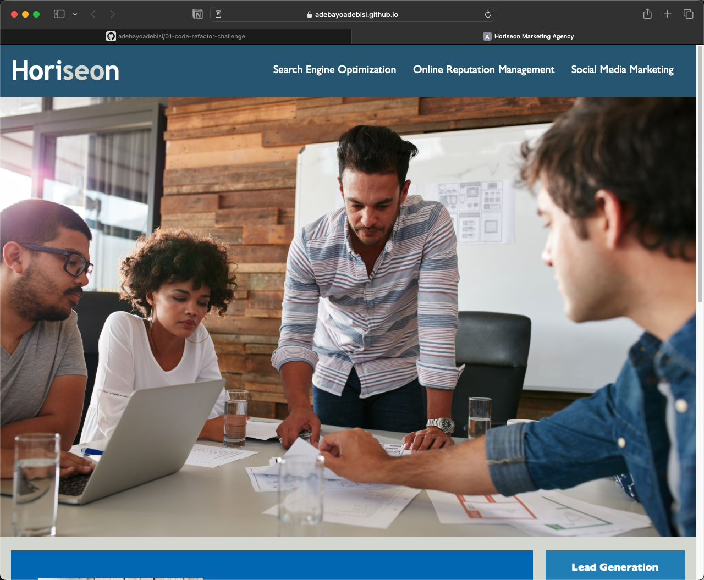
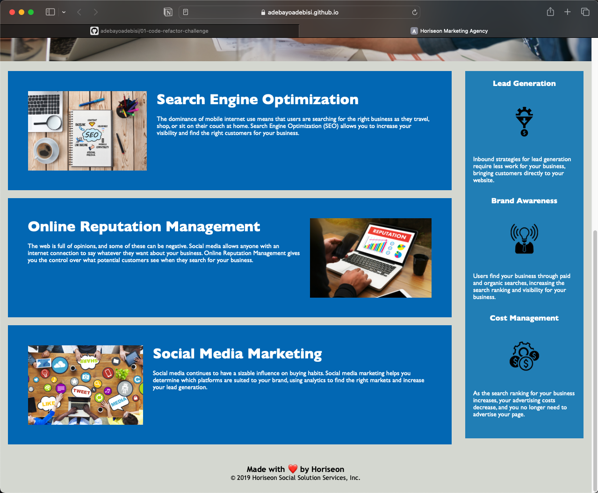

# 01-code-refactor-challenge

# Code Refactor – Accessibility and SEO Optimization.

## Description
A marketing agency, Horiseon, want a codebase that follows accessibility standards, so that their website is optimized for search engines.

## Summary of Changes
Changes made in accordance to the acceptance criteria.
- Replaced non-semantic elements: 'div' with the appropriate semantic HTML elements throughout the source code. Semantic elements used include 'header', 'main', 'nav', 'section', 'article', 'aside', 'figure' and 'footer'.
- Ensured HTML elements followed a logical structure independent of styling and positioning.
- Ensured the image and icon elements contain accessible alt attributes descriptive of what the images and icons represent on the webpage. 
- Ensured that the Heading attributes (h1, h2 and h3) fall in sequential order. These were already in the right order from the base code.
- Inserted a concise descriptive title into Title elements. Changed ‘website’ to ‘Horiseon Marketing Agency’.

## Horiseon Website
The following images shows the Horiseon web application's appearance and functionality:

> **Note** This is a screenshot of the Horiseon webpage's navigation bar and header image.

> **Note** This is a screenshot of the Horiseon webpage's main content showing cards with text and images at the bottom of the page.

## License
Licensed under the MIT License

## GitHub Repository
URL: https://github.com/adebayoadebisi/01-code-refactor-challenge  

## Deployed Web Application
URL: https://adebayoadebisi.github.io/01-code-refactor-challenge/ 